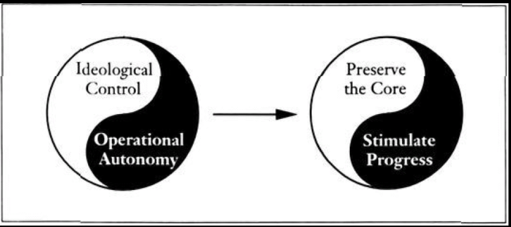

* Built to last notes

- A global visionary company separates operating practices and business strategies (which should vary from country to country) from core values and purpose (which should be universal and enduring within the company, no matter where it does business).

- But, just as any great idea or market opportunity eventually becomes obsolete, the founding goal of a social-cause organization can be met or become irrelevant. Looking for a deeper, more enduring purpose that goes beyond the original founding concept therefore becomes vitally important to building a lasting organization.

- The only truly reliable source of stability is a strong inner core and the willingness to change and adapt everything except that core. 

# Chapter 1: The best of the best

- What is a visionary company? 
    - Premier institution in its industry
    - Widely admired by knowledgeable businesspeople
    - Made an indelible imprint on the world in which we live
    - Had multiple generations of chief executives
    - Been through multiple product (or service) life cycles
    - Founded before 1950

# Chapter 2: Clock Building, Not Time Telling

- The primary output of their efforts is not the tangible implementation of a great idea, the expression of a charismatic personality, the gratification of their ego, or the accumulation of personal wealth. Their greatest creation is the company itself and what it stands for.

- we found that creating and building a visionary company absolutely does not require either a great idea or a great and charismatic leader. In fact, we found evidence that great ideas brought forth by charismatic leaders might be negatively correlated with building a visionary company. 

- In short, we found a negative correlation between early entrepreneurial success and becoming a highly visionary company. The long race goes to the tortoise, not the hare.

- “Thus, early in our project, we had to reject the great idea or brilliant strategy explanation of corporate success and consider a new view. We had to put on a different lens and look at the world backward. We had to shift from seeing the company as a vehicle for the products to seeing the products as a vehicle for the company. We had to embrace the crucial difference between time telling and clock building.”

- If you equate the success of your company with success of a specific idea—as many businesspeople do—then you’re more likely to give up on the company if that idea fails; and if that idea happens to succeed, you’re more likely to have an emotional love affair with that idea and stick with it too long, when the company should be moving vigorously on to other things. But if you see the ultimate creation as the company, not the execution of a specific idea or capitalizing on a timely market opportunity, then you can persist beyond any specific idea—good or bad—and move toward becoming an enduring great institution.

- **Charisma Not Required**: Indeed, we found that some of the most significant chief executives in the history of the visionary companies did not have the personality traits of the archetypal high-profile, charismatic visionary leader.
    - In fact, we speculate that a highly charismatic style might show a slight negative correlation with building a visionary company, but the data on style are too spotty and soft to make a firm statement.

    - But, as with great products, perhaps the continuity of superb individuals atop visionary companies stems from the companies being outstanding organizations, not the other way around.

- If you’re involved in building and managing a company, we’re asking you to think less in terms of being a brilliant product visionary or seeking the personality characteristics of charismatic leadership, and to think more in terms of being an organizational visionary and building the characteristics of a visionary company.

# Chapter 2.5: Interlude No “Tyranny of the OR” (Embrace the “Genius of the AND”)

- In short, a highly visionary company doesn’t want to blend yin and yang into a gray, indistinguishable circle that is neither highly yin nor highly yang; it aims to be distinctly yin and distinctly yang—both at the same time, all the time.

- The test of a first-rate intelligence is the ability to hold two opposed ideas in the mind at the same time, and still retain the ability to function.

# Chapter 3: More Than Profits

 - “As an aside, if you’re at the early stages in the development of a company and have been putting off articulating a corporate ideology until you’ve attained business success, you might pause to consider the Sony example. We found that Ibuka’s ideology laid down so early in the company’s history played an important role in guiding the company’s evolution.

- Our plan is to lead the market with new products, rather than ask them what kind of products they want.... Instead of doing a lot of market research, we...refine a product...and try to create a market for it by educating and communicating with the public.

- There was a great deal of talk about the sequence of the three              P’s—people, products, and profits. It was decided that people
                    should absolutely come first [products second and profits third].

- “Contrary to business school doctrine, we did not find “maximizing shareholder wealth” or “profit maximization” as the dominant driving force or primary objective
                        through the history of most of the visionary companies. They have tended
                    to pursue a cluster of objectives, of which making money is only one—and
                    not necessarily the primary one. Indeed, for many of the visionary companies,
                    business has historically been more than an economic activity, more than just a
                    way to make money. Through the history of most of the visionary companies we saw
                    a core ideology that transcended purely economic considerations. And—this
                    is the key point—they have had core ideology to a greater degree than
                        the comparison companies in our study.

- “Of course, we’re not saying that the visionary companies have
                    been uninterested in profitability or long-term shareholder wealth (notice that
                    we say that they are “more than” economic entities, not
                        “other than”). Yes, they pursue profits. And, yes, they
                    pursue broader, more meaningful ideals. Profit maximization does not rule, but
                    the visionary companies pursue their aims profitably. They do both.”

- “PROFITABILITY is a necessary condition for
                        existence and a means to more important ends, but it is not the end in
                        itself for many of the visionary companies. Profit is like oxygen, food,
                        water, and blood for the body; they are not the point of life, but
                        without them, there is no life.”

- “As we investigate this, we inevitably come to the
                    conclusion that a group of people get together and exist as an institution that
                    we call a company so they are able to accomplish something collectively that
                    they could not accomplish separately—they make a contribution to society,
                    a phrase which sounds trite but is fundamental.... You can look around [in the
                    general business world] and still see people who are interested in money and
                    nothing else, but the underlying drives come largely from a desire to do
                    something else—to make a product—to give a
                    service—generally to do something which is of value. ”

- If we provide real satisfaction to real customers—we will be profitable.

- VISIONARY companies like Motorola don’t see it as a choice between living to their values or being pragmatic; they see it as a challenge to find pragmatic solutions and behave consistent with their core values.

- IN short, we did not find any specific ideological content essential to being a visionary company. Our research indicates that the authenticity of the ideology and the extent to which a company attains consistent alignment with the ideology counts more than the content of the ideology.

- We concluded that the critical issue is not whether a company has the “right” core ideology or a “likable” core ideology but rather whether it has a core ideology—likable or not—that gives guidance and inspiration to people inside that company.

- “How can we be sure that the core ideologies of highly
                    visionary companies represent more than just a bunch of nice-sounding
                    platitudes—words with no bite, words meant merely to pacify, manipulate,
                    or mislead? We have two answers. First, social psychology research strongly
                    indicates that when people publicly espouse a particular point of view, they
                    become much more likely to behave consistent with that point of view even if
                        they did not previously hold that point of view. In other
                    words, the very act of stating a core ideology (which the visionary companies
                    have done to a far greater degree than the comparison companies) influences
                    behavior toward consistency with that ideology.”
                    Second—and more important—the visionary companies
                    don’t merely declare an ideology; they also take steps to make the
                    ideology pervasive throughout the organization and transcend any individual
                    leader. 

- Core Ideology = Core Values + Purpose
- Core Values = The organization’s essential and enduring
                        tenets—a small set of general guiding principles; not to be confused
                        with specific cultural or operating practices; not to be compromised for
                        financial gain or short-term expediency.
- Purpose = The organization’s fundamental reasons for
                        existence beyond just making money—a perpetual guiding star on the
                        horizon; not to be confused with specific goals or business strategies.
    

- Core values are the organization’s essential and
                    enduring tenets, not to be compromised for financial gain or short-term
                    expediency.

- Visionary companies tend to have only a few core values, usually
                    between three and six. 

- “A very important point: We strongly encourage you not to fall
                    into the trap of using the core values from the visionary companies (listed in
                    Table 3.1) as a source for core values in your own organization. Core ideology
                    does not come from mimicking the values of other companies—even highly
                    visionary companies; it does not come from following the dictates of outsiders;
                    it does not come from reading management books; and it does not come from a
                    sterile intellectual exercise of “calculating” what values would
                    be most pragmatic, most popular, or most profitable”

- When articulating and
                    codifying core ideology, the key step is to capture what is authentically
                    believed, not what other companies set as their values or what the outside world
                    thinks the ideology should be.

- It’s important to understand that core ideology exists as an internal element, largely independent of the external environment.

- IN a visionary company, the core values need no rational or external justification. Nor do they sway with the trends and
                        fads of the day. Nor even do they shift in response to changing market
                        conditions.

- When properly conceived, purpose is broad, fundamental, and
                    enduring; a good purpose should serve to guide and inspire the organization for
                    years, perhaps a century or more.

- In short, a visionary company can, and usually does, evolve into
                    exciting new business areas, yet remain guided by its core purpose.
                As an implication of this, if you’re thinking about purpose
                    for your own organization, we encourage you to not simply “As an implication of this, if you’re thinking about purpose
                    for your own organization, we encourage you to not simply write a specific
                    description of your product lines or customer segments (“We exist to make
                        X products for Y customers”). For example, “We
                    exist to make cartoons for kids” would have been a terrible purpose
                    statement for Disney, neither compelling nor flexible enough to last one hundred
                    years. But “to use our imagination to bring happiness to millions”
                    can easily last one hundred years as a compelling purpose.”

- We want to be clear: We did not find an explicit and formal
                    statement of purpose in all of our visionary companies.

- We’ve found that most companies benefit from articulating both core values and purpose in their core ideology, and we encourage you to do the same.

# Chapter 4: Preserve the Core/Stimulate Progress
- A company can have the world’s most deeply cherished and meaningful core ideology, but if it just sits still or refuses to change, the world will pass it by.

- “We’ve found that companies get into trouble by confusing core ideology with specific, noncore practices. By confusing core ideology with noncore practices, companies can cling too long to noncore items—things that should be changed in order for the company to adapt and move forward. This brings us to a crucial point: A visionary company carefully preserves and protects its core ideology, yet all the specific manifestations of its core ideology must be open for change and evolution.”

- “Through the drive for progress, a highly visionary company displays a powerful mix of self-confidence combined with self-criticism. Self-confidence allows a visionary company to set audacious goals and make bold and daring moves, sometimes flying in the face of industry conventional wisdom or strategic prudence; it simply never occurs to a highly visionary company that it can’t beat the odds, achieve great things, and become something truly extraordinary. Self-criticism, on the other hand, pushes for self-induced change and improvement before the outside world imposes the need for change and improvement; a visionary company thereby becomes its own harshest critic. As such, the drive for progress pushes from within for continual change and forward movement in everything that is not part of the core ideology.”

- “The interplay between core and progress is one of the most important findings from our work. In the spirit of the “Genius of the AND,” a visionary company does not seek mere balance between core and progress; it seeks to be both highly ideological and highly progressive at the same time, all the time. Indeed, core ideology and the drive for progress exist together in a visionary company like yin and yang of Chinese dualistic philosophy; each element enables, complements, and reinforces the other”

- To be sure, a highly visionary company does have these, but it also has concrete, tangible mechanisms to preserve the core ideology and to stimulate progress.

- Hewlett-Packard didn’t just talk about the HP Way; it instituted a religious promote-from-within policy and translated its philosophy into the categories used for employee reviews and promotions, making it nearly impossible for anyone to become a senior executive without fitting tightly into the HP Way. 

- We’ve found that organizations often have great intentions and inspiring visions for themselves, but they don’t take the crucial step of translating their intentions into concrete items. Even worse, they often tolerate organization characteristics, strategies, and tactics that are misaligned with their admirable intentions, which creates confusion and cynicism.

- **IF you are involved in building and managing an organization, the single most important point to take away from this book is the critical importance of creating tangible mechanisms aligned to preserve the core and stimulate progress. This is the essence of clock building.**

# Chapter 5: Big Hairy Audacious Goals (BHAGs)
- A BHAG is a clear and compelling target for an organization to strive toward, a goal

- THE BHAGs looked more audacious to outsiders than to insiders. The visionary companies didn’t see their audacity as taunting the gods. It simply never occurred to them that they couldn’t do what they set out to do.

- Although we’ve written this chapter primarily from a corporate perspective, BHAGs can be applied to stimulate progress at any level of an organization. Individual product line managers at P&G frequently set BHAGs for their brands.

- Indeed, most entrepreneurs have a built-in BHAG: To just get off the ground and reach a point where survival is no longer in question is huge and audacious for most start-ups.

- “A BHAG has the inherent danger that, once achieved, an organization can stall and drift in the “we’ve arrived” syndrome, as happened at Ford in the 1920s. A company should be prepared to prevent this by having follow-on BHAGs. It should also complement BHAGs with the other methods of stimulating progress.”

- In fact, BHAGs can help to reinforce one of the key sets of mechanisms for preserving the core ideology: a cult-like culture

# Chapter 6: Cult-Like Cultures
- A visionary company has a cult-like culture, but it is not a cult. It is a culture that is so strong and so pervasive that it is almost impossible for anyone to be in the company and not be influenced by it. 

- When we began our research project, we speculated that our evidence would show the visionary companies to be great places to work (or at least better places to work than the comparison companies). However, we didn’t find this to be the case—at least not for everyone.

- We learned that you don’t need to create a “soft” or “comfortable” environment to build a visionary company. We found that the visionary companies tend to be more demanding of their people than other companies, both in terms of performance and congruence with the ideology.

- “VISIONARY,” we learned, does not mean soft and undisciplined. Quite the contrary. Because the visionary companies have such clarity about who they are, what they’re all about, and what they’re trying to achieve, they tend to not have much room for people unwilling or unsuited to their demanding standards.

- It is important to understand that, unlike many religious sects or social movements which often revolve around a charismatic cult leader (a “cult of personality”), visionary companies tend to be cult-like around their ideologies.

- “a cult-like culture can be dangerous and limiting if not complemented with the other side of the yin-yang. Cult-like cultures, which preserve the core, must be counterweighted with a huge dose of stimulating progress. In a visionary company, they go hand in hand, each side reinforcing the other.”

- 

# Chapter 7: Try a Lot of Stuff and Keep What Works
- “It might be far more satisfactory to look at well-adapted visionary companies not primarily as the result of brilliant foresight and strategic planning, but largely as consequences of a basic process—namely, try a lot of experiments, seize opportunities, keep those that work well (consistent with the core ideology), and fix or discard those that don’t.”

- “For one thing, companies do in fact have the ability to set goals and plan. Species do not. And certainly our visionary companies do set goals and make plans—even Wal-Mart, which has simultaneously pursued both BHAGs and evolutionary progress throughout its history. It uses BHAGs to define a mountain to climb, and uses evolution to invent a way to the top. Jack Welch at General Electric embraced this paradoxical mixture of goals and evolution in a management idea labeled “planful opportunism,” as described by Tichy and Sherman in Control Your Own Destiny or Someone Else Will:”

- Visionary companies, on the other hand, stimulate evolutionary progress toward desired ends within the context of a core ideology—a process we call purposeful evolution.

- IF well understood and consciously harnessed, evolutionary processes can be a powerful way to stimulate progress. And that’s exactly what the visionary companies have done to a greater degree than the comparison companies.

- ALTHOUGH the invention of the Post-it note might have been somewhat accidental, the creation of the 3M environment that allowed it was anything but an accident.

-  five basic lessons for stimulating evolutionary progress in a visionary company:
    1. Give it a try—and quick
    2. Accept that mistakes will be made
    3. Take small steps
    4. Give people the room they need.
    5. Mechanisms—build that ticking clock

- “Never forget to preserve the core while stimulating evolutionary progress. Keep in mind that evolution involves both variation and selection. In a visionary company, like 3M, selection involves two key questions. The first is simply pragmatic: Does it work? But just as important is the second question: Does it fit with our core ideology?”

# Chapter 8: Home-Grown Management
- “Visionary companies develop, promote, and carefully select managerial talent grown from inside the company to a greater degree than the comparison companies. They do this as a key step in preserving their core. Over the period 1806 to 1992, we found evidence that only two visionary companies (11.1 percent) ever hired a chief executive directly from outside the company, compared to thirteen (72.2 percent) of the comparison companies.”

-  If you’re involved with an organization that feels it must go outside for a top manager, then look for candidates who are highly compatible with the core ideology. They can be different in managerial style, but they should share the core values at a gut level.

- Simply put, our research leads us to conclude that it is extraordinarily difficult to become and remain a highly visionary company by hiring top management from outside the organization. Equally important, there is absolutely no inconsistency between promoting from within and stimulating significant change.

- Your company should have management development processes and long-range succession planning in place to ensure a smooth transition from one generation to the next.

# Chapter 9: Good Enough Never Is
- There is no ultimate finish line in a highly visionary company. There is no “having made it.” There is no point where they feel they can coast the rest of the way, living off the fruits of their labor.

- Like great artists or inventors, visionary companies thrive on discontent. They understand that contentment leads to complacency, which inevitably leads to decline.

- If the marketplace doesn’t provide enough competition, why not create a system of internal competition that makes it virtually impossible for any brand to rest on its laurels? 

- cutting off mature product lines that accounted for significant sales volume, thus forcing itself to fill the gap with new products

- “General Electric institutionalized internal discomfort with a process called “work out.” Groups of employees meet to discuss opportunities for improvement and make concrete proposals. Upper managers are not allowed to participate in the discussion, but must make on-the-spot decisions about the proposals, in front of the whole group—he or she cannot run, hide, evade, or procrastinate.”

- It assigns managers the task of developing strategy as if they worked for a competing company with the aim of obliterating Boeing. What weaknesses would they exploit? What strengths would they leverage? What markets could be easily invaded? Then, based on these responses, how should Boeing respond?

- MANAGERS at visionary companies simply do not accept the proposition that they must choose between short-term performance or long-term success. They build first and foremost for the long term while simultaneously holding themselves to highly demanding short-term standards.

- Again, comfort is not the objective in a visionary company.

- “Indeed, the discipline of self-improvement stands out as one of the most clear differences between the visionary and comparison companies. Taking into account mechanisms of discomfort and long-term investments for the future, we found that the visionary companies have driven themselves harder for self-improvement in sixteen out of eighteen cases”

- Good old-fashioned hard work, dedication to improvement, and continually building for the future will take you a long way.

# Chapter 10: The end of the beginning
- “The essence of a visionary company comes in the translation of its core ideology and its own unique drive for progress into the very fabric of the organization—into goals, strategies, tactics, policies, processes, cultural practices, management behaviors, building layouts, pay systems, accounting systems, job design—into everything that the company does.”

- A visionary company creates a total environment that envelops employees, bombarding them with a set of signals so consistent and mutually reinforcing that it’s virtually impossible to misunderstand the company’s ideology and ambitions.

- Unlike many high-technology companies, HP avoided outside investors like venture capitalists because “they can push companies to grow too fast, and if you grow too fast, you can lose your values.”

- VISIONARY companies do not rely on any one program, strategy, tactic, mechanism, cultural norm, symbolic gesture, or CEO speech to preserve the core and stimulate progress. It’s the whole ball of wax that counts.

- God is in the details.

- Visionary companies don’t put in place any random set of mechanisms or processes. They put in place pieces that reinforce each other, clustered together to deliver a powerful combined punch. They search for synergy and linkages.

- “Alignment means being guided first and foremost by one’s own internal compass, not the standards, practices, conventions, forces, trends, fads, fashions, and buzzwords of the outer world. Not that you should ignore reality—quite the contrary—but your company’s own self-defined ideology and ambitions should guide all of its dealings with reality.”

- THE real question to ask is not “Is this practice good?” but “Is this practice appropriate for us—does it fit with our ideology and ambitions?”

- Keep in mind that the only sacred cow in a visionary company is its core ideology. Anything else can be changed or eliminated.

- But as you walk away from reading this book, we hope you will take away four key concepts to guide your thinking for the rest of your managerial career, and to pass on to others. These concepts are:
    1. Be a clock builder—an architect—not a time teller.
    2. Embrace the “Genius of the AND.”
    3. Preserve the core/stimulate progress.
    4. Seek consistent alignment.

- we discovered that those who build visionary companies are not necessarily more brilliant, more charismatic, more creative, more complex thinkers, more adept at coming up with great ideas—in short, more wizardlike—than the rest of us. The builders of visionary companies tend to be simple—some might even say simplistic—in their approaches to business. Yet simple does not mean easy.

# Chapter 11L: Building the vision
- A well-conceived vision consists of two major components—core ideology and an envisioned future.

- To pursue the vision means to create organizational and strategic alignment to preserve the core ideology and stimulate progress toward the envisioned future. Alignment brings the vision to life, translating it from good intentions to concrete reality.

-  it is far more important to know who you are than where you are going, for where you are going will certainly change as the world about you changes.

- Any effective vision must embody the core ideology of the organization, which in turn consists of two distinct sub-components: core values and core purpose.

    - **core values:** Core values are the organization’s essential and enduring tenets—a small set of timeless guiding principles that require no external justification; they have intrinsic value and importance to those inside the organization

    - If the circumstances changed and penalized us for holding this core value, would we still keep it?” If you can’t honestly answer yes, then it’s not core and should be dropped.

    - **core purpose:** Core purpose, the second component of core ideology, is the organization’s fundamental reason for being.

    - Pushed to choose between core purpose and core values, we would likely choose core purpose as the more important of the two for guiding and inspiring an organization. It is also more difficult to identify than core values.

    - An effective purpose reflects the importance people attach to the company’s work—it taps their idealistic motivations—rather than just describing the organization’s output or target customers. It captures the soul of the organization.

    - “Purpose (which should last at least 100 years) should not be confused with specific goals or business strategies (which should change many times in 100 years). Whereas you might achieve a goal or complete a strategy, you cannot fulfill a purpose; it is like a guiding star on the horizon—forever pursued, but never reached. ”

    - “One powerful method for getting at purpose is the “Five Whys.” Start with the descriptive statement, “We make X products” or “we deliver X services,” and then ask “why is that important?” five times. After a few whys, you’ll find that you’re getting down to the fundamental purpose of the organization. ”

- As Peter Drucker has pointed out, the best and most dedicated people are ultimately volunteers, for they have the opportunity to do something else with their lives.

- “A very important point: You do not “create” or “set” core ideology. You discover core ideology. It is not derived by looking to the external environment; you get at it by looking inside. It has to be authentic. You can’t fake an ideology. Nor can you just “intellectualize” it. Do not ask, “What core values should we hold?” Ask instead: “What core values do we actually hold?” Core values and purpose must be passionately-held on a gut level or they are not core.”

- Core ideology need only be meaningful and inspirational to people inside the organization; it need not be exciting to all outsiders. 

- You cannot “install” new core values or purpose into people. Core values and purpose are not something people “buy in” to. People must already have a predisposition to holding them. 

- An organization will generate a variety of statements over time to describe the core ideology.

- Finally, don’t confuse “core ideology” with the concept of “core competence.” Here’s the difference: Core competence is a strategic concept that captures your organization’s capabilities—what you are particularly good at—whereas core ideology captures what you stand for and why you exist. 

- Envisioned future—the second primary component of the vision framework—consists of two parts: a ten- to thirty-year “Big Hairy Audacious Goal” and vivid descriptions of what it will be like when the organization achieves the BHAG.

- In creating such a vision-level BHAG we suggest thinking about the following four categories: target, common enemy, role model, or internal transformation.

- “Creating alignment, which is a key part of our ongoing work to help companies transform themselves into visionary companies, requires two key processes: 1) developing new alignments to preserve the core and stimulate progress, and 2) eliminating misalignments—those that drive the company away from the core ideology and those that impede progress toward the envisioned future.
”

| Company | Concepts from Built to Last | Concrete examples and how they fit | Where the fit is incomplete |
|---|---|---|---|
| **Apple** | **Clock building; home-grown management; preserve the core/stimulate progress; BHAGs** | **Clock building:** Its functional organization gives specialists authority and requires collaboration across functions, creating a system for repeated innovation. **Home-grown management:** Tim Cook joined in 1998 before becoming CEO in 2011. **Core and progress:** Its emphasis on integrated user experience continued through expansion into wearables, services, and its own chips. **BHAG:** Its announced goal of carbon neutrality across its business, supply chain, and product life cycle by 2030 is ambitious and time-bound. ([Organization](https://www.apple.com/careers/pdf/HBR_How_Apple_Is_Organized_For_Innovation-4.pdf), [leadership history](https://www.apple.com/leadership/tim-cook/), [2030 goal](https://www.apple.com/newsroom/2020/07/apple-commits-to-be-100-percent-carbon-neutral-for-its-supply-chain-and-products-by-2030/)) | Institutional continuity beyond Jobs does not mean charismatic leadership was unimportant. An announced BHAG demonstrates ambition, not achievement. |
| **Microsoft** | **Preserve the core/stimulate progress; home-grown management; good enough never is** | **Core and progress:** Its enduring identity is building tools and platforms that enable others to create. Windows, cloud services, and AI represent different ways of pursuing that purpose. **Home-grown management:** Nadella joined in 1992 before becoming CEO in 2014. **Continuous improvement:** Its growth-mindset culture emphasizes learning and questioning assumptions, supported by employee development and feedback systems. ([Annual report](https://www.microsoft.com/investor/reports/ar24/index.html), [Nadella biography](https://news.microsoft.com/source/exec/satya-nadella/)) | Its cultural transformation required replacing some established practices. The fit depends on distinguishing enduring purpose from historical habits. |
| **Amazon** | **Try a lot of stuff and keep what works; good enough never is; genius of the AND** | **Experimentation:** Its 2016 shareholder letter advocates patient experiments, accepting failures, and increasing investment when customers respond well. **Continuous improvement:** “Day 1” treats complacency as a continuing threat. **Genius of the AND:** Amazon seeks the capabilities of a large organization and the speed of a startup. Mechanisms include lighter approval processes for reversible decisions and committing to decisions despite disagreement. ([2016 shareholder letter](https://www.aboutamazon.com/news/company-news/2016-letter-to-shareholders)) | Customer obsession does not by itself establish “more than profits.” The letter describes an intended operating philosophy; consistent implementation requires separate examination. |
| **Netflix** | **Cult-like cultures; genius of the AND; clock building; good enough never is** | **Strong culture:** Its culture memo emphasizes candor, autonomy, and demanding performance expectations. The “keeper test” translates expectations into retention decisions. **Genius of the AND:** Employees receive substantial freedom and clear accountability. **Clock building:** Significant decisions have a designated responsible person, supported by dissent and subsequent reflection. **Continuous improvement:** Its culture explicitly calls for improving how the company operates as it grows. ([Culture memo](https://jobs.netflix.com/culture)) | A demanding performance culture is not automatically an enduring core ideology. Netflix also expects its culture to evolve, making the distinction between permanent values and changeable practices important. |
| **Patagonia** | **More than profits; preserve the core; clock building; genius of the AND; alignment** | **More than profits:** Environmental protection is tied to how earnings are used. **Preserve the core and clock building:** In 2022, voting ownership transferred to the Patagonia Purpose Trust to protect its mission; nonvoting ownership transferred to the Holdfast Collective. **Genius of the AND:** Patagonia remains a for-profit business while distributing excess profits, after reinvestment, to support environmental work. **Alignment:** Its ownership and corporate charter give its purpose consequences beyond a mission statement. ([Ownership structure](https://www.patagonia.com/ownership/)) | Patagonia acknowledges that business growth still creates environmental harm. Its ownership structure cannot eliminate the tension between selling more products and reducing consumption. |