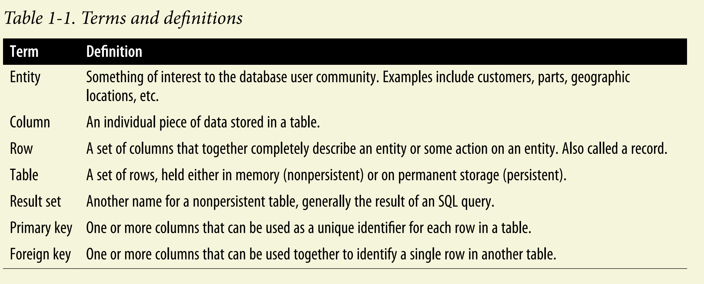

## introduction to database
- Database: **A database is nothing more than a set of related information.**
- Primary key: **A primary key is a column or a set of columns that uniquely identifies each row in the table.**
- Foreign key: **A foreign key is a column or a set of columns that establishes a link between the data in two tables.**
- Join tables: **Joining tables is a way to combine data from two or more tables based on a related column between them.**



## SQL statement classes
1. SQL schema statements: **which are used to define the data structures stored in the database**
2. SQL data statements: **which are used to manipulate the data stored in the database**
3. SQL transaction statements: **which are used to begin, end, and roll back transactions**

## some basic SQL statements

- `SELECT`: **used to retrieve data from a database**
- `FROM`: **used to specify the table from which to retrieve data**
- `WHERE`: **used to filter records based on specified conditions**
```sql
SELECT /* one or more columns */ 
FROM /* table name */ 
WHERE /* condition */;
```
- `/* this is a comment in sql */`

- `INSERT`: **used to add new records to a table**
```sql
INSERT INTO /* table name */ (/* column1, column2, ... */)
VALUES (/* value1, value2, ... */);
```

- `UPDATE`: **used to modify existing records in a table**
```sql
UPDATE /* table name */
SET /* column1 = value1, column2 = value2, ... */
WHERE /* condition */;
```

