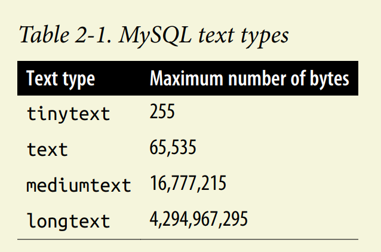
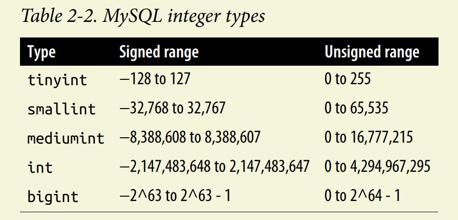
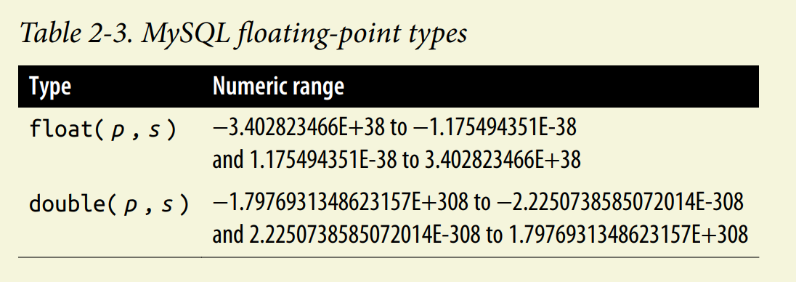
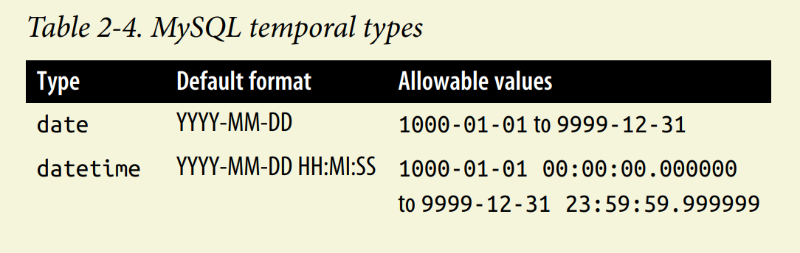
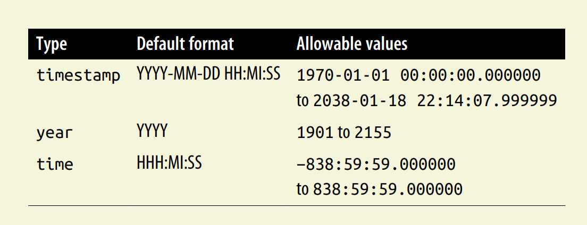
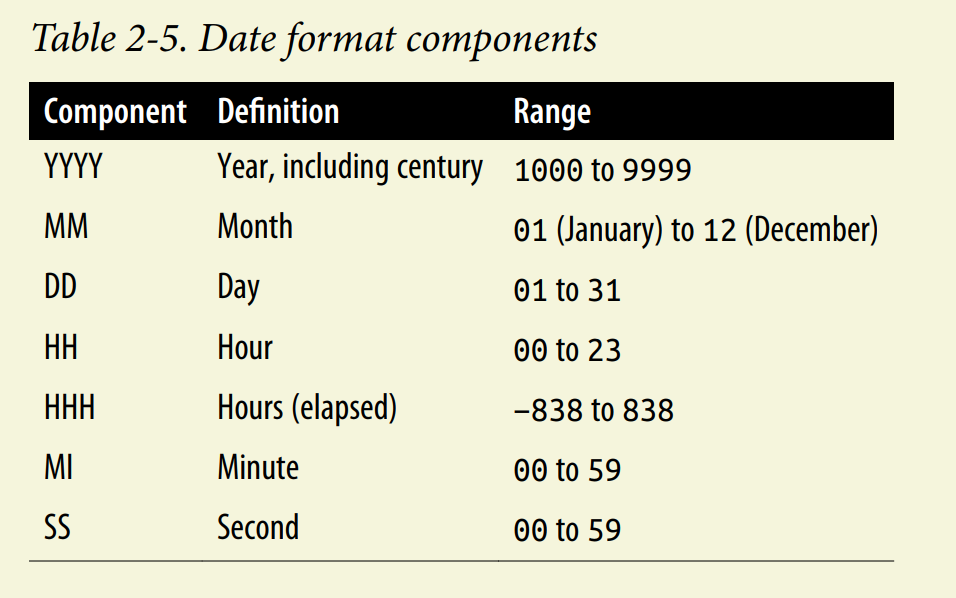

# Data Types
## Character Data
- Character data can be stored as either **fixed-length or variable-length strings**; the difference is that fixed-length strings are right-padded with spaces and always consume
the same number of bytes, and variable-length strings are not right-padded with
spaces and don’t always consume the same number of bytes.

```sql
char(20) /* fixed-length string, right-padded with spaces, always consumes 20 bytes */
varchar(20) /* variable-length string, not right-padded with spaces */
```

- If you need to store longer strings (such as emails, XML documents, etc.), then you will want to use one of the text types (mediumtext
and longtext).

-  To choose
a character set other than the default when defining a column, simply name one of
the supported character sets after the type definition, as in:

```sql
varchar(20) character set utf8mb4
```
### text types

- If you need to store data that might exceed the 64 KB limit for varchar columns, you
will need to use one of the text types.



## numeric Data
- different interger types:




- floating point types:

    - When using a floating-point type, you can specify a precision (the total number of
allowable digits both to the left and to the right of the decimal point) and a scale (the
number of allowable digits to the right of the decimal point), but they are not
required. 



## temporal data




